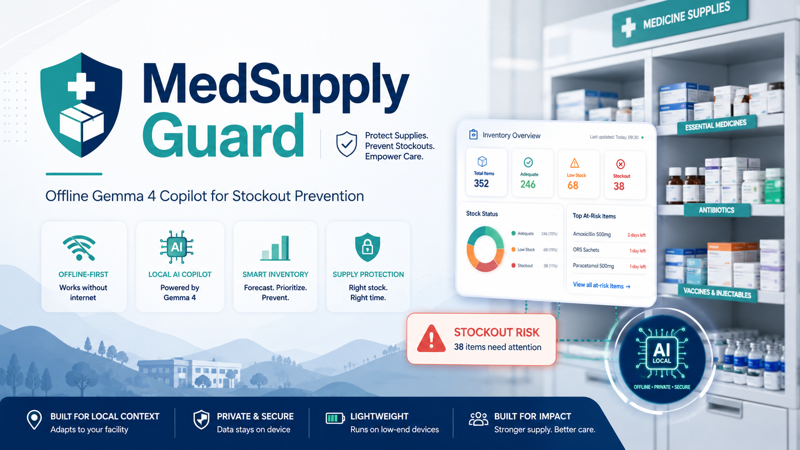

# MedSupply Guard

Offline-first Gemma 4 copilot for preventing essential medicine stockouts in resource-constrained clinics.

<p align="center">
  
</p>

## What it does

MedSupply Guard combines deterministic inventory analytics with grounded Gemma 4 explanations to help clinic logistics teams identify stockout risk, choose suppliers, generate procurement messages, and safely refuse clinical questions.

## Purpose
MedSupply Guard helps clinic logistics/procurement staff detect essential medicine stockout risks, evaluate supplier lead times, generate reorder recommendations, and create evidence-backed procurement messages.

This is a Kaggle competition prototype. It is not a clinical decision system.

## Safety boundary
MedSupply Guard supports logistics and procurement decisions only. It does not provide diagnosis, prescribing advice, dosage guidance, clinical substitutions, or patient-specific medical recommendations.

## Architecture
- Streamlit UI
- CSV data ingestion
- Deterministic Python inventory analytics
- Gemma 4 runtime copilot for grounded explanations and procurement messages
- Evidence trail for source rows and assumptions
- Deterministic Markdown procurement brief generation
- Deterministic What-if Scenario Simulator

## Why Gemma 4?
Gemma 4 is used for its open-weights accessibility and strong offline performance. By running `gemma4:e2b` locally via Ollama, clinics with low or no internet connectivity can still benefit from a powerful logistics assistant without compromising data privacy.

## Quick start
```bash
python -m venv .venv
source .venv/bin/activate  # Windows: .venv\Scripts\activate
pip install -r requirements.txt
```

### Mock Mode
```bash
# Windows
$env:GEMMA_BACKEND="mock"
streamlit run app.py
```

### Ollama Mode
```bash
ollama pull gemma4:e2b
# Windows
$env:GEMMA_BACKEND="ollama"
$env:GEMMA_MODEL="gemma4:e2b"
streamlit run app.py
```

### Demo Scenario Flow
When the app launches, check the **Demo Scenario: Oxytocin Injection** section. It highlights a critical stockout risk where suppliers cannot arrive in time, demonstrating how MedSupply Guard handles infeasible supply chains. Use the Gemma 4 Copilot section below to generate a procurement message or ask why Oxytocin is prioritized over Amoxicillin.

### Visual Risk Overview

The Streamlit dashboard includes two lightweight visual charts:

- **Risk distribution chart** — shows how many medicines are currently classified as critical, high, medium, low, or unknown risk.
- **Days-of-cover chart** — shows medicines sorted by remaining days of cover, helping logistics staff quickly identify items closest to stockout.

These charts are generated from the deterministic analytics output. They do not change the underlying calculations and do not rely on Gemma 4 for scoring.

### What-if Scenario Simulator

MedSupply Guard includes a deterministic What-if Scenario Simulator that allows logistics managers to test operational disruptions before they happen (e.g., Demand surge +25%, Supplier delay +7 days). It uses in-memory transformations and does not alter the original CSV files or use Gemma to invent values.

## Tests
```bash
pytest
```

## Sample data
Synthetic sample data is in `data/sample/`.
